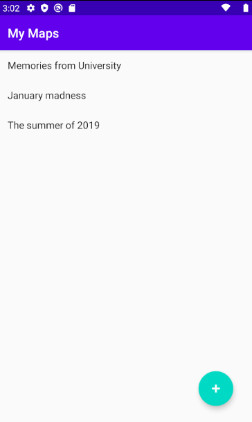
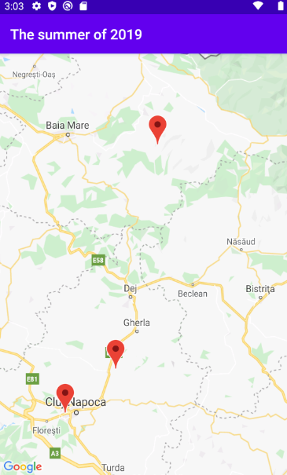
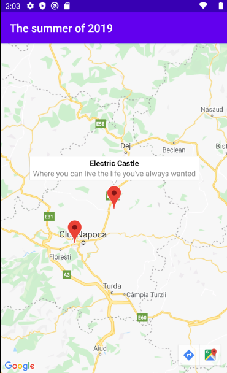
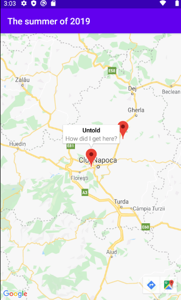
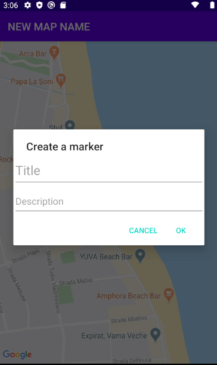
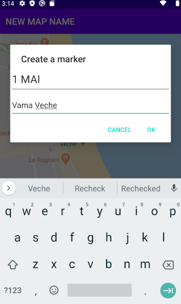
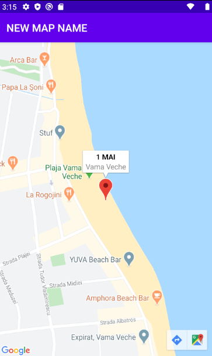

This app lets you put your memories in one place or help you plan your next trip using Google Maps API 

Open the app and you can se the plans that have already been made

When you tap on a plan you can see the pins made by the user

When you tap on a pin it displays you the title and the description of the place

By now you can see only the plans written in the code. But I'm working on the "adding plans" feature where you navigate on the map and set your pins by long pressing. Then you are presented with a layout that lets you set a title and a description for that place

After you set the title and the description the pin is set on the map

